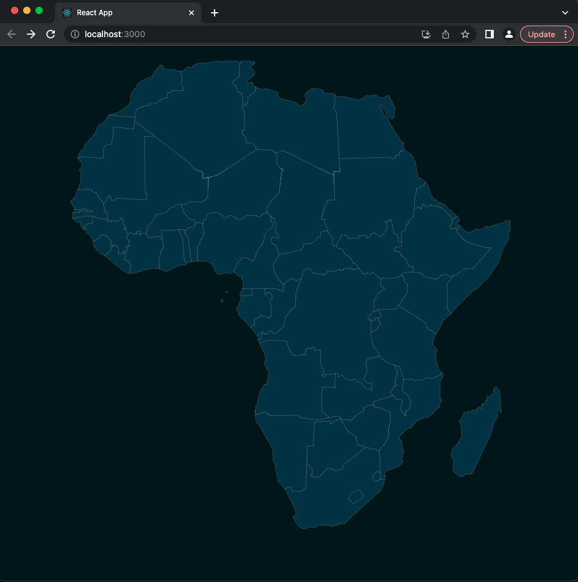
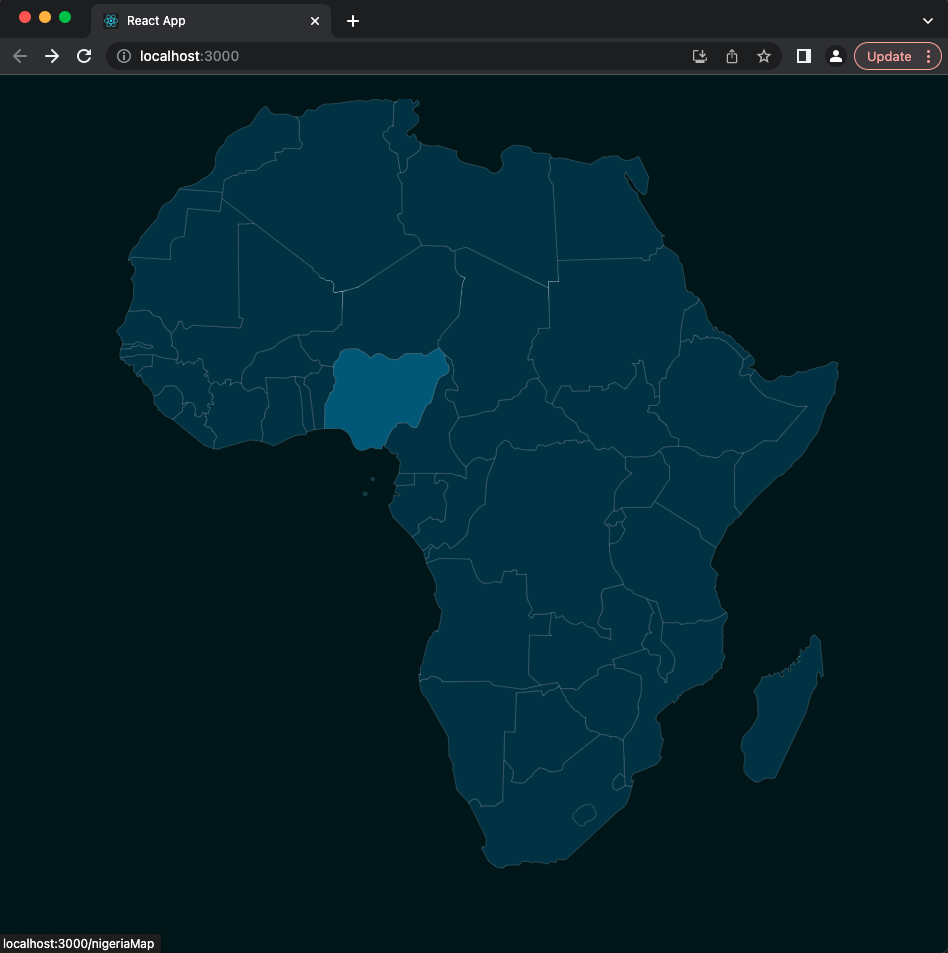
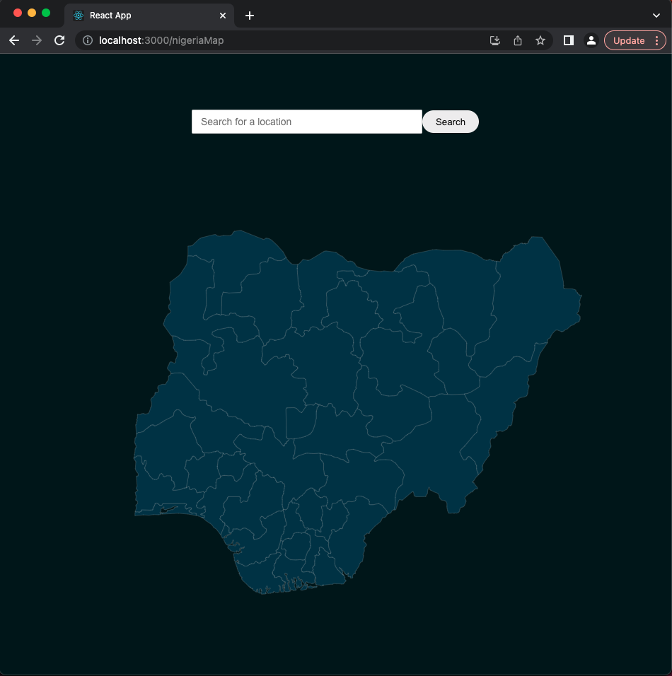

The following is a React application designed to facilitate streamlined user interaction. It is invoked via the command line, first call
- "npm install" and then call
- "npm start"
Functionality of the application which eventually allows users to both upload and view photographs an videos which have been geo-tagged to their creators' respective locations. 

Though this application is still under active development, it boasts an impressive user interface which offers intuitive methods of location selection. Utilizing maps as an intuitive user interface, the two screenshots below demonstrate the process of selecting locations with ever-increasing accuracy. 

Choose an initial location on the map.

Narrow in on specific location
 

